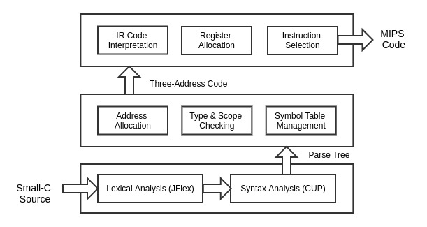

# Small-C Compiler for MIPS32

A toy compiler that compiles [_Small-C_](https://en.wikipedia.org/wiki/Small-C) source code into _MIPS_ code, 
refactored from [my previous course project](doc/5120109159.pdf).

## Workflow

## Dependencies

[java-cup-11a.jar](http://www2.cs.tum.edu/projects/cup/)

[JFlex.jar](http://jflex.de/download.html)

## Build and Run

To build the compiler, put dependent library jar files in lib/ and run:

	make -C src/
	ant

To compile a source file in the directory in/, run the following command:

	export CLASSPATH='bin:lib/JFlex.jar:lib/java_cup_11a.jar'
	java com.gmail.devinz1993.smallc.Compiler [FILE_NAME]

You can also run my batch test using the following command:

	./run.sh

